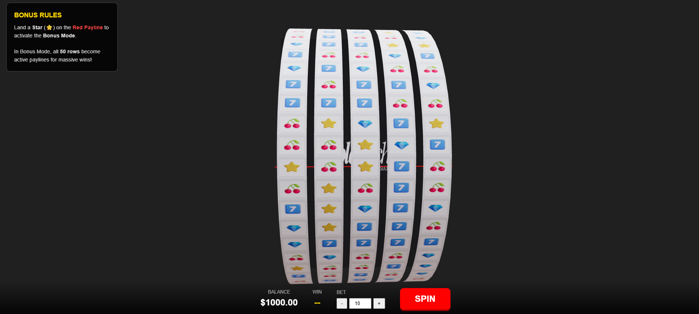

# 3D Slot Machine Game

A high-quality 3D slot machine game built with React, TypeScript, Three.js, and React Three Fiber. Features realistic 3D reels with smooth animations, configurable symbols, and an immersive bonus round system.

## Demo

Watch the game in action:

[](demo.mp4)

<video width="100%" controls>
  <source src="demo.mp4" type="video/mp4">
  Your browser does not support the video tag. [Download the video](demo.mp4) to view it.
</video>

## Features

- **5 Reel Slot Machine**: Classic 5-reel slot game with 50 symbols per reel
- **3D Graphics**: High-quality 3D reels rendered with Three.js, forming a perfect 360-degree cylinder
- **Interactive Camera**: Zoom, rotate, and pan around the slot machine using mouse/touch controls
- **Configurable Symbols**: Easy-to-edit symbol map system for customizing reel strips
- **Bonus Feature**: Land a Star (⭐) symbol on the red payline to activate Bonus Mode
  - All 50 rows become active paylines
  - Massive win potential with multiple winning combinations
- **Visual Effects**:
  - Flashing winning symbols
  - Animated paylines (red for main, blue for bonus, green when winning)
  - Smooth reel spinning with deceleration
- **Sound Effects**: Immersive audio feedback for spins, wins, and button clicks
- **Game Mechanics**:
  - Balance and betting system
  - Left-to-right symbol matching (3, 4, or 5 of a kind)
  - Configurable symbol multipliers
  - Win evaluation across all active paylines

## Getting Started

### Prerequisites

- Node.js (v16 or higher)
- npm or yarn

### Installation

1. Clone the repository:
```bash
git clone <repository-url>
cd slot3d
```

2. Install dependencies:
```bash
npm install
```

3. Start the development server:
```bash
npm run dev
```

4. Open your browser to the URL shown in the terminal (typically `http://localhost:5173`)

### Building for Production

```bash
npm run build
```

The built files will be in the `dist` directory.

## Configuration

### Symbol Map

Edit `src/symbolMap.json` to customize which symbols appear on each reel. The file contains an array of 5 reels, each with 50 symbol IDs.

### Regenerating Symbol Map

Run the generator script to create a new random symbol map:

```bash
node scripts/generateSymbolMap.js
```

You can modify `scripts/generateSymbolMap.js` to:
- Change the number of symbols per reel
- Adjust bonus symbol frequency
- Use different symbol distributions

### Symbol Configuration

Edit `src/store.ts` to modify:
- Symbol definitions (texture, multiplier, color)
- Default balance
- Default bet amount
- Win evaluation logic

## Game Rules

1. **Standard Play**: Match 3, 4, or 5 symbols from left to right on the red center payline
2. **Bonus Activation**: Land a Star (⭐) symbol on the red payline
3. **Bonus Mode**: Your next spin activates all 50 rows as paylines
   - Every row is evaluated for winning combinations
   - Multiple wins can occur simultaneously
   - Winning paylines flash green

## Project Structure

```
slot3d/
├── src/
│   ├── assets/
│   │   ├── sounds/          # Audio files
│   │   └── logo.avif        # Playtech logo
│   ├── components/
│   │   ├── Reel.tsx         # 3D reel component with animation
│   │   ├── SlotMachine.tsx  # Main 3D scene
│   │   └── UI.tsx           # Game UI overlay
│   ├── utils/
│   │   └── textureGenerator.ts  # Dynamic symbol texture creation
│   ├── store.ts             # Game state management (Zustand)
│   ├── symbolMap.json       # Reel symbol configuration
│   └── App.tsx              # Root component
├── scripts/
│   └── generateSymbolMap.js  # Symbol map generator
└── README.md
```

## Technologies Used

- **React** - UI framework
- **TypeScript** - Type safety
- **Three.js** - 3D graphics library
- **React Three Fiber** - React renderer for Three.js
- **@react-three/drei** - Useful helpers for R3F
- **Zustand** - State management
- **Vite** - Build tool and dev server

## Controls

- **Mouse Drag**: Rotate camera around the slot machine
- **Scroll Wheel**: Zoom in/out
- **Right Click + Drag**: Pan the camera
- **Spin Button**: Start a new spin
- **Bet Controls**: Adjust bet amount (+/- buttons or input field)

## Customization

### Adding New Symbols

1. Add symbol definition to `DEFAULT_SYMBOLS` in `src/store.ts`
2. Update `scripts/generateSymbolMap.js` to include the new symbol ID
3. Regenerate the symbol map

### Adjusting Reel Count

1. Update `reelCount` in `src/store.ts`
2. Update `REEL_COUNT` in `scripts/generateSymbolMap.js`
3. Regenerate the symbol map

### Changing Spin Duration

Edit `spinDuration` in `src/components/Reel.tsx` (line 65)

## License

This project is for educational/demonstration purposes.

## Credits

- Built with modern web technologies
- 3D graphics powered by Three.js
- Sound effects included in assets

